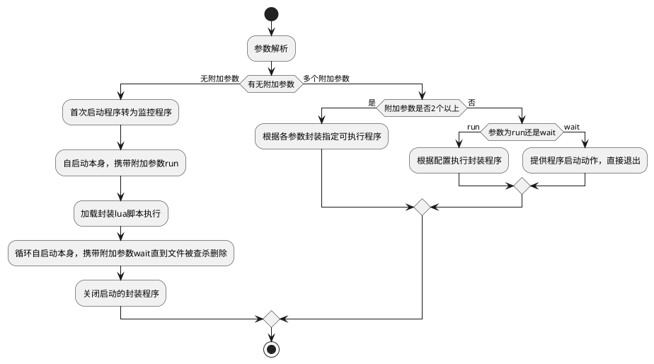

[TOC]

# 1. VirGenerator 简介

VirGenerator 主要用于包装其他windows可执行程序，并提供内存加载执行和提取到临时目录执行两种方式，支持包装lua脚本执行。

# 2. 使用方式

可使用命令行对指定程序进行封装（注意示例中的文件均在同一目录并且现在的工作目录就在当前目录）
```
VirGenerator.exe MsgBusTool_x64.exe msg.exe bootkit.lua 1
```

|  参数序号 | 参数含义  | 示例参数  |
| ------------ | ------------ | ------------ |
|  1 | 包装器程序路径  |  VirGenerator.exe |
|  2 | 封装程序路径  | MsgBusTool_x64.exe  |
|  3 | 封装后得到的目标程序路径  | msg.exe  |
|  4 | 包含的lua脚本  | bootkit.lua  |
|  5 | 是否通过内存加载方式还是临时目录方式执行（内存加载时随便天一个，提取临时目录执行不填就行）  | 1  |

# 3. 封装后程序执行逻辑



# 4. lua导出函数

| 导出函数名称  | 使用方式示例  | 参数解析  |
| ------------ | ------------ | ------------ |
| **create_file**  | create_file(path, content) -> int(0=fail,1=ok)  | path为文件路径，content为创建文件后写入内容，返回值是int，注意写入内容是覆盖  |
| **move_file**  | move_file(oldPath, newPath) -> int(0/1)  | 参数对应源路径和新路径，返回值同上  |
| **delete_file**  | delete_file(path) -> int(0/1)  | path为文件路径  |
| **modify_file**  | modify_file(path, text) -> int(0/1)  | 注意这个修改文件是新增的方式修改，如果要只修改一部分暂时做不到  |
| **start_process**  | start_process(exePath, cmdArgs) -> int(pid)  | exePath表示可执行程序进程，cmdArgs表示启动命令行参数，返回进程id  |
| **kill_process**  | kill_process(pid) -> int(0/1)  | 关闭指定进程id的进程  |
| **add_registry**  | add_registry("HKLM", "Software\\MyApp", "ValueName", 1234) -> int(0/1)  | HKLM表示注册表根键，已在下表列出，"Software\\MyApp"这部分需要填下面的路径，"ValueName"要填键的名称，1234这部分可以是数字和字符串，目前只支持REG_SZ和REG_DWORD  |
| **modify_registry**  | modify_registry("HKLM", "Software\\MyApp", "ValueName", 1234) -> int(0/1)  | 该方法直接调用的add_registry，只是为了编码时好理解，可直接都是用add_registry  |
| **get_registry_string**  | get_registry_string("HKLM", "Software\\MyApp", "TestString") -> string  | 参数与add_registry顺序相同，只是缺少配置值的参数  |
| **get_registry_dword**  | get_registry_dword("HKLM", "Software\\MyApp", "TestDword") -> int(dword值)   | 参数与add_registry顺序相同，只是缺少配置值的参数  |
| **delete_registry**  | delete_registry("HKLM", "Software\\MyApp", "ValueName") -> int(0/1)  | 参数与add_registry顺序相同，只是缺少配置值的参数  |
| **kill_process_by_name**  | kill_process_by_name("notepad.exe") -> int(关闭的进程数量)  | 参数使用进程名称即可  |
| **get_current_process_name**  | get_current_process_name() -> string  | 获取当前进程进程名称，主要为了配合kill_process_by_name关闭当前所有进程  |


